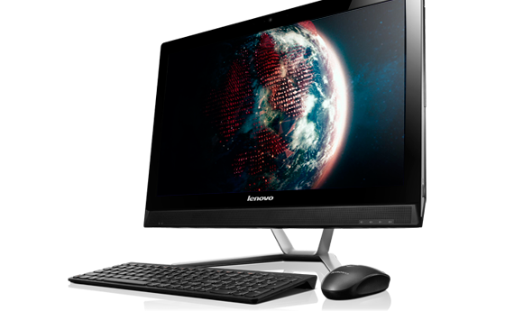
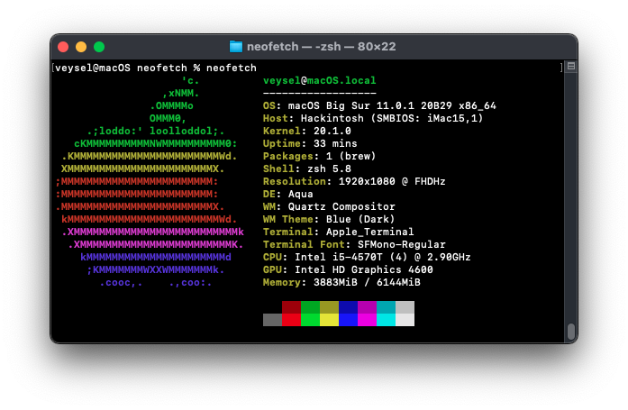
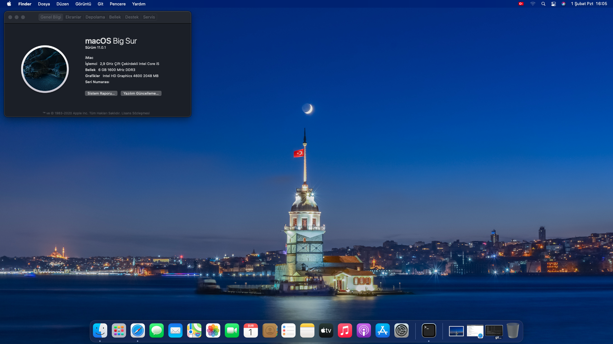

# Lenovo C560 All-in-One | Intel i5 (4570T)

Türkçe | [English](https://github.com/sutsurup/ASUS-K555UB-Hackintosh/blob/master/README_EN.md)

**macOS Versiyonu: 11.0.1**

**OpenCore Versiyonu: 0.6.5**

Yardımcı olabilecek kaynaklar: 

- [OpenCore Yükleme Rehberi](https://dortania.github.io/OpenCore-Install-Guide)

# Detaylar

    Tarih:        Şubat 2, 2021
    Durum:        Stabil
    Destek:       BIOS (1.18)
    Yapı:         OpenCore

## Donanım

| **LENOVO** | Detay                                                  |
| ------------------- | ------------------------------------------- |
| Model Ismi      | Lenovo C560      |
| Anakart           | 	Lenovo C560     |
| CPU              | Intel(R) Core(TM) i5-4570T CPU @ 2.90GHz Haswell              |
| RAM           | Hynix HMT451S6AFR8A-PB 4 GB + 2GB DDR3 1600 MHz SODIMM (Total: 6GB)   |
| Dahili Grafik Kartı | Intel(R) HD Graphics 4600 (1GB)                    |
| Wi-Fi | Qualcomm Atheros AR9485 (VEN_168C&DEV_0032)                  |
| Ses       | Realtek ALC272 (Layout: 3)                        |
| BIOS Versiyonu      | 1.18                   |

## Uyumluluk
**macOS Big Sur 11.0.1** sürümünde çalışmaktadır. Muhtemel 11.x sürümlerine güncelleme yapabilirsiniz.
Releases bölümünde EFI klasörü için zip dosyası paylaştım. macOS kurulum belleğinizdeki EFI için ayrılan disk bölümünde, EFI adında bir klasör oluşturun ve zip içerisindeki BOOT ve OC klasörlerini EFI klasörü içerisine kopyalayınız.
macOS High Sierra 10.13.6, Mojave 10.14.6 veya Catalina 10.15.7 sürümlerinde çalıştırmayı deneyebilirsiniz

### Çalışıyor

- [x] Uyku
- [x] Ethernet (Yama yapıldı)
- [x] Ses (Layout: 13)

### Çalışmıyor
- [ ] Ekran parlaklığı
- [ ] Wi-Fi + Bluetooth

## Kurulum sonrası yararlanabileğiniz rehber bağlantıları
* önerilir: iCloud'a giriş yapacaksanız veya iMessage, FaceTime kullanmak istiyorsanız, bu rehberi harfiyen uygulayın: [OpenCore ile iMessage ve Apple Servislerini Aktif Etmek](https://osxinfo.net/konu/opencore-ile-imessage-ve-apple-servislerini-aktif-etmek.16297/) (Bu rehberde Clover Configurator gösterilmiş, siz OpenCore Configurator kullanacaksınız, Clover Configurator üzerinden takip edin, verileri OpenCore Configurator aracılığıyla config.plist dosyanıza girin)
* [ProperTree](https://osxinfo.net/konu/propertree-opencore-bootloader-icin-config-duzenleyici.12919/) (config.plist düzenlemek için)
* Hackintool ([Forum thread](https://www.insanelymac.com/forum/topic/335018-hackintool-v286/) | [Direkt indirme linki](http://headsoft.com.au/download/mac/Hackintool.zip)) (Detaylı sistem bilgileri öğrenme ve düzenlemeleri için)

## İletişime geçin
Herhangi bir adımda sorun yaşıyorsanız, öncelikli olarak [issue](https://github.com/sutsurup/LENOVO-C560-AIO-Hackintosh/issues) bölümüne destek talebi açın! Diğer sorularınız için, Website: http://sutsurup.com // Mail: [contact@sutsurup.com](contact@sutsurup.com)

## Ekran Görüntüleri

Kolay gelsin!
