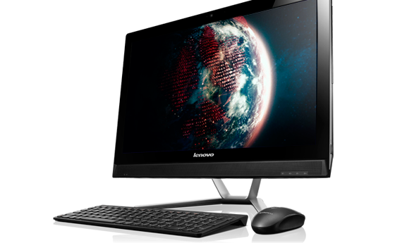

````markdown
# Lenovo C560 All-in-One | Intel i5 (4570T)

[](https://www.apple.com/tr/macos/big-sur/)
[](https://github.com/acidanthera/OpenCorePkg)
[](https://github.com/sutsurup/LENOVO-C560-AIO-Hackintosh/releases)



[Türkçe](README.md) | English

**macOS Version: 11.0.1**

**OpenCore Version: 0.6.5**

Helpful resources:

- [OpenCore Install Guide](https://dortania.github.io/OpenCore-Install-Guide)


# Details

    Date:         February 2, 2021
    Status:       Stable
    Support:      BIOS (1.18)
    Build:        OpenCore

## Hardware

| **LENOVO** | Detail                                                  |
| ------------------- | ------------------------------------------- |
| Model Name      | Lenovo C560      |
| Motherboard           | 	Lenovo C560     |
| CPU              | Intel(R) Core(TM) i5-4570T CPU @ 2.90 GHz Haswell              |
| RAM           | Hynix HMT451S6AFR8A-PB 4 GB + 2 GB DDR3 1600 MHz SODIMM (Total: 6 GB)   |
| Integrated GPU | Intel(R) HD Graphics 4600 (1 GB)                    |
| Wi-Fi | Qualcomm Atheros AR9485 (VEN_168C&DEV_0032)                  |
| Audio       | Realtek ALC272 (Layout: 3)                        |
| BIOS Version      | 1.18                   |


## Compatibility
This works on **macOS Big Sur 11.0.1**. You can probably update to other 11.x releases.
I shared a zip file under the Releases section containing the EFI folder. Create a folder named EFI on the EFI partition of your macOS installation media and copy the BOOT and OC folders from the zip into that EFI folder.
You can also try running macOS High Sierra 10.13.6, Mojave 10.14.6 or Catalina 10.15.7.

### Working

- [x] Sleep
- [x] Ethernet (patched)
- [x] Audio (Layout: 13)

### Not working
- [ ] Screen brightness
- [ ] Wi-Fi + Bluetooth


## Guides you may find useful after installation
* Recommended: if you plan to sign in to iCloud or use iMessage/FaceTime, follow this guide exactly: [Enable iMessage and Apple Services with OpenCore](https://osxinfo.net/konu/opencore-ile-imessage-ve-apple-servislerini-aktif-etmek.16297/) (The guide demonstrates Clover Configurator; use OpenCore Configurator and enter the values into your config.plist via OpenCore Configurator)
* [ProperTree](https://osxinfo.net/konu/propertree-opencore-bootloader-icin-config-duzenleyici.12919/) (for editing config.plist)
* Hackintool ([Forum thread](https://www.insanelymac.com/forum/topic/335018-hackintool-v286/) | [Direct download link](http://headsoft.com.au/download/mac/Hackintool.zip)) (for detailed system information and tweaks)

## About Wi‑Fi
This device has an Atheros AR9485 wireless card. Support for this card was dropped in newer macOS releases. While older releases like Mojave and Catalina can be made to work with some tweaks, I didn't pursue bringing this card to full performance on Big Sur. Although this is an all-in-one machine, it is used as a desktop; using Ethernet is generally the more sensible choice for reliability. Replacing the wireless card with a different one is another viable option.

## Contact
If you experience issues at any step, first open a support request in the [issues](https://github.com/sutsurup/LENOVO-C560-AIO-Hackintosh/issues) section! For other questions, Website: https://sutsurup.tr // Mail: veysel@sutsurup.tr

## Screenshots


</details>

## Support
If you found the project useful and want to support my work, you can donate to help with resources:
```
₿ 1Q8CEMHTuecxPUJpEdpRiG6Bg2GVtzw4bN
```
<a href='https://github.com/sutsurup/sutsurup/blob/main/Donate.md'></a>
```
Click the QR code for alternative options
```

````
